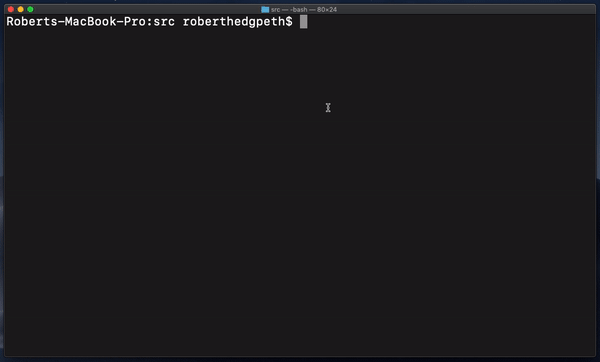

# Quick Start: Python and MariaDB

This repository will walk you through the process of quickly getting started with [python3](https://www.python.org/) and [MariaDB](https://github.com/mariadb-developers/mariadb-getting-started) using the [MariaDB Python connector](https://github.com/mariadb-corporation/mariadb-connector-python).

<p align="center" spacing="10">
    <kbd>
        
    </kbd>
</p>

## Requirements

This sample requires the following to be installed/enabled on your machine:

* [Python (v. 3+)](https://www.python.org/downloads/)
* [MariaDB Connector/C (v. 3.1.5+)](https://mariadb.com/products/skysql/docs/clients/mariadb-connector-c-for-skysql-services/) (used by Connector/Python, find more information [here](https://mariadb.com/docs/clients/mariadb-connectors/connector-python/install/))

## Installing MariaDB Connector/Python

To run the sample code in this repository you'll first need to [install the MariaDB Python connector (driver)](https://mariadb.com/docs/clients/mariadb-connectors/connector-python/install/).

## Running these samples

Once you've installed the MariaDB Python connector you're ready to run the [tasks.py](src/tasks.py) sample.

The [tasks.py](src/tasks.py) sample can be used to:

* `Create` a database and table (necessary for the subsequent CRUD operations).

    ```bash
    $ python3 tasks.py create
    ```

* `Drop` the database (and table).

    ```bash
    $ python3 tasks.py drop
    ```

* `Insert` a new tasks record.

    ```bash
    $ python3 tasks.py add 'New Task Description'
    ```

* `Update` a task record's completion field (by specifying the `id` and `completion` value).

    ```bash
    $ python3 tasks.py update 3 1
    ```

* `Select` and print all tasks.

    ```bash 
    $ python3 tasks.py show
    ```

* `Delete` a task record (by `id`).

    ```bash
    $ python3 tasks.py delete 3
    ```

## Helpful Resources

* [How to connect Python programs to MariaDB](https://mariadb.com/resources/blog/how-to-connect-python-programs-to-mariadb/) (blog)
* [Official MariaDB Documentation](https://mariadb.com/docs)
* [MariaDB Quickstart Guide](https://github.com/mariadb-developers/mariadb-getting-started)

## Support and Contribution

Please feel free to submit PR's, issues or requests to this project directly.

If you have any other questions, comments, or looking for more information on MariaDB please check out:

* [MariaDB Developer Hub](https://mariadb.com/developers)
* [MariaDB Community Slack](https://r.mariadb.com/join-community-slack)

Or reach out to us directly via:

* [developers@mariadb.com](mailto:developers@mariadb.com)
* [MariaDB Twitter](https://twitter.com/mariadb)

## License <a name="license"></a>
[](https://opensource.org/licenses/MIT)
